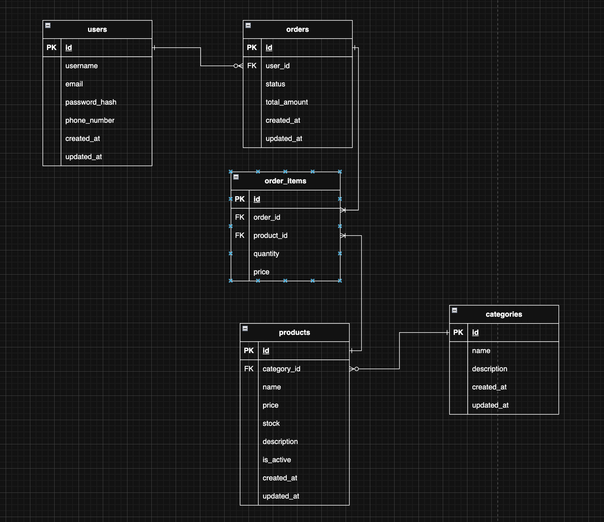

# 🛒 RevoShop - Database Schema (Checkpoint 1)

This repository contains the foundational relational database design, seed scripts, and SQL queries for the **RevoShop** e-commerce backend platform.

## 📁 Repository Structure

```text
.
├── .gitignore          # Ignored OS and database temporary files
├── README.md           # Project documentation and setup guide
├── erd-diagram.png     # Entity Relationship Diagram (ERD)
├── schema.sql          # DDL script for creating tables and relationships
├── seed.sql            # DML script for inserting sample data
└── queries.sql         # Sample analytical SQL queries

---

## ERD Diagram


